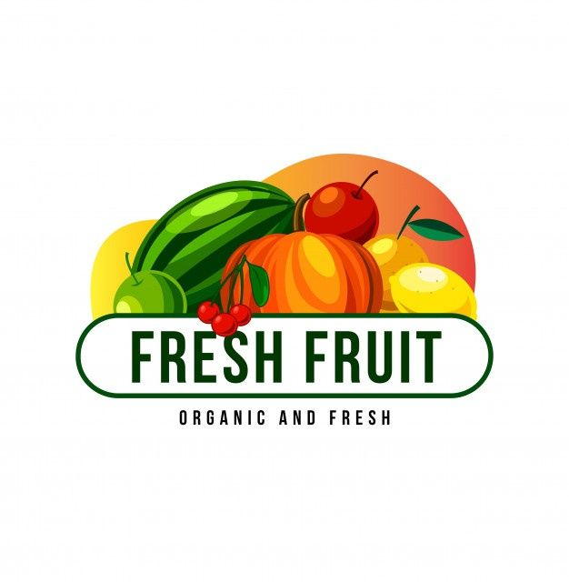

  

  
# Hortfruit App

## Descrição
O Hortfruit App é um aplicativo desenvolvido em Flutter que permite aos usuários explorar uma variedade de frutas e verduras disponíveis, além de oferecer funcionalidades de login, cadastro de usuários e perfis de usuário.

## Funcionalidades

### Login
O aplicativo possui uma tela de login onde os usuários podem acessar suas contas inserindo seu email e senha.

### Cadastro de Usuários
Os novos usuários podem se cadastrar no aplicativo preenchendo um formulário que solicita nome, email, número de telefone e uma foto de perfil.

### Listagem de Frutas e Verduras Disponíveis
Os usuários podem navegar por uma lista de frutas e verduras disponíveis no Hortfruit. Cada item na lista exibe informações detalhadas sobre o produto, como nome, preço e disponibilidade.

### Perfil de Usuário
Os usuários têm a opção de visualizar e editar seu perfil, incluindo informações como nome, email, número de telefone e foto de perfil.

## Instalação

1. Clone este repositório:
- `git clone https://github.com/Lamarkes/flutter-catolicafruit/edit/main/app_catolicafruit `
2. Navegue até o diretório do projeto:
- `cd app_catolicafruit`
3. Instale as dependências:
- `flutter pub get`
4. Execute o aplicativo:
- `flutter run`

## Getting Started

This project is a starting point for a Flutter application.

A few resources to get you started if this is your first Flutter project:

- [Lab: Write your first Flutter app](https://docs.flutter.dev/get-started/codelab)
- [Cookbook: Useful Flutter samples](https://docs.flutter.dev/cookbook)

For help getting started with Flutter development, view the
[online documentation](https://docs.flutter.dev/), which offers tutorials,
samples, guidance on mobile development, and a full API reference.
